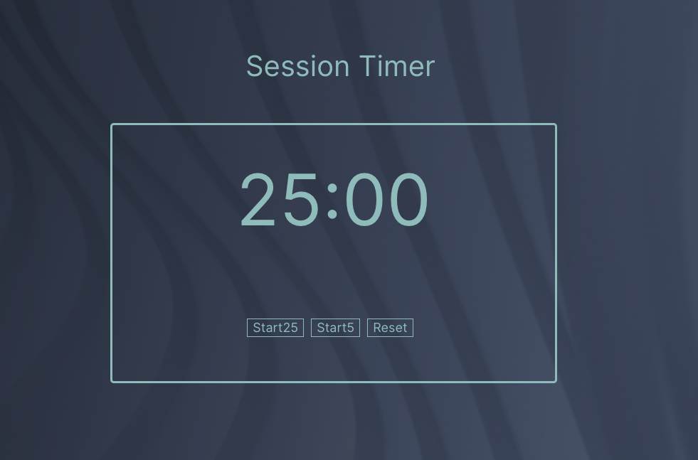
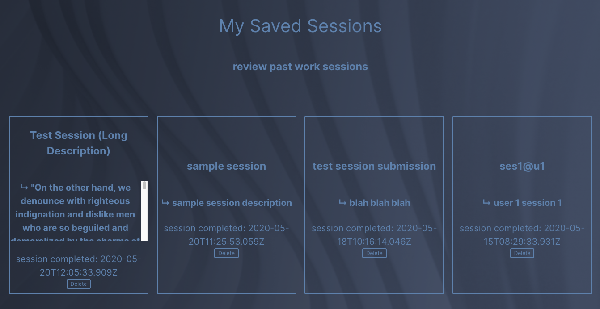
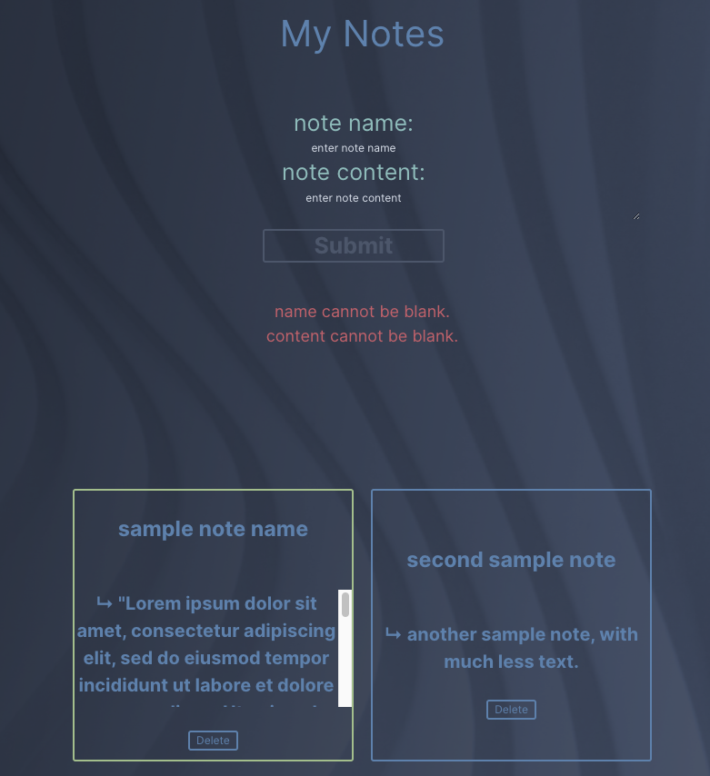

# Pomodoro Server

This is the server for the Pomodoro App client.
+ Client repo found [here](https://github.com/meta-434/capstone-one-client)
+ Live site found [here](pomodoro.alex-hapgood.info)

## Concept
The design of the Pomodoro App intends to provide the user with a fully-featured digital pomodoro timer, complete 
with session saving and notes for reference. A signed up user, upon completion of a 25-minute pomdoro work session,
may save the details of the session to the server. The timestamped session saves under the user's unique account credentials,
which the user may review at a later time. Notes may be similarly saved, and the timer page displays the most recent
note for reference during work sessions. 

## Set up

Complete the following steps to start a new project (NEW-PROJECT-NAME):

1. Clone this repository to your local machine `git clone BOILERPLATE-URL NEW-PROJECTS-NAME`
2. `cd` into the cloned repository
3. Install the node dependencies `npm install`
4. Update the `.env` file with a `PORT`, your `SECRET_KEY` for authentication key generation, your `DATABASE_URL`, and optionally, a `TEST_DATABASE_URL`.
5. Run `yarn run migrate` without any parameters to create your database.
6. Run the SQL scripts in /seeds on your postgres database to provide test data.
7. Run `yarn run dev` to start the nodemon server.

## Scripts

Start the application `yarn run dev`

Run migration SQL scripts `npm run migrate`

Run the tests `yarn run test`

## Tech
+ Node.js
+ Express
+ PostgreSQL
+ JWT
+ Mocha, Chai
+ Swaggerhub Inspector / Swaggerhub Editor (API Documentation)

## API Documentation

for hosted API documentation, including request / response schema, 
please visit: https://app.swaggerhub.com/apis-docs/meta-434/pomodoro-api/1.4

## Screenshots

timer: 
 

sessions display: 
 

notes display: 
 

